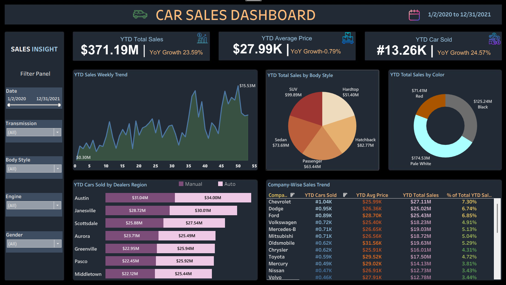

# 🚗 Car Sales Dashboard - Tableau

## 📊 Project Overview
This project involves designing and developing a dynamic, interactive **Car Sales Dashboard** using Tableau. The dashboard is built for a car dealership to effectively track and analyze sales performance, visualize critical Key Performance Indicators (KPIs), and help stakeholders make data-driven decisions to identify trends and opportunities for growth.

🔗 **View the Live Interactive Dashboard Here:** [Car Sales Tableau Dashboard](https://public.tableau.com/app/profile/chamika.nelushan/viz/CarSalesTablueDashboard/Dashboard1)

---

## 📸 Dashboard Preview

*Figure 1: Interactive Car Sales Dashboard showing YTD metrics, weekly trends, and regional analysis*

---

## 🎯 Project Objectives
* To design a comprehensive dashboard that provides real-time insights into sales data.
* To enable stakeholders to make informed decisions, monitor progress, and identify growth opportunities.
* To visualize complex data relationships using interactive charts, filters, and KPI cards.

---

## 📋 Problem Statement

### 1. KPI Requirements
The dashboard provides real-time insights into the following Key Performance Indicators:
* **Sales Overview:**
  * Year-to-Date (YTD) Total Sales
  * Year-over-Year (YOY) Growth in Total Sales
* **Average Price Analysis:**
  * YTD Average Price
  * YOY Growth in Average Price
* **Cars Sold Metrics:**
  * YTD Cars Sold
  * YOY Growth in Cars Sold

### 2. Visualization Requirements
To break down the data effectively, the following charts were implemented:
1. **YTD Sales Weekly Trend:** A line chart illustrating the weekly trend of YTD sales (X-axis: Weeks, Y-axis: Total Sales Amount).
2. **YTD Total Sales by Body Style:** A Pie chart visualizing the distribution of YTD total sales across different car body styles.
3. **YTD Total Sales by Color:** A Donut chart presenting the contribution of various car colors to the YTD total sales.
4. **YTD Cars Sold by Dealer Region:** A Bar chart showcasing YTD sales data geographically based on different dealer regions.
5. **Company-Wise Sales Trend:** A tabular grid displaying the sales trend for each company, including Company Name and YTD sales figures.

---

## 🗄️ Dataset Information
The dashboard is powered by a comprehensive car sales transaction dataset (`Car Sales Data.xlsx`). 

**Key Columns Include:**
* **Transaction Details:** `Car_id`, `Date`, `Price ($)`
* **Customer Demographics:** `Customer Name`, `Gender`, `Annual Income`, `Phone`
* **Vehicle Specifications:** `Company`, `Model`, `Engine`, `Transmission`, `Color`, `Body Style`
* **Dealer Information:** `Dealer_Name`, `Dealer_No`, `Dealer_Region`

---

## 🛠️ Functionalities & Tableau Skills Applied
Building this dashboard required utilizing several intermediate to advanced Tableau functionalities:
* ✅ Connecting Tableau to Flat Files (Excel)
* ✅ Use of Date Functions for time-based analysis
* ✅ Creating Custom Calculated Fields for **YTD** and **YoY** Growth metrics
* ✅ Implementing Level of Detail (LOD) expressions (if applicable for complex aggregations)
* ✅ Designing Different Custom Charts (Line, Pie, Donut, Bar, and Text/Grid)
* ✅ Advanced Charts Formatting and Dashboard Background Design
* ✅ Creating Quick and Interactive Filters (Date Range, Transmission, Body Style, Engine, Gender)

---

## 💡 How to Interact with the Dashboard
1. **Filter by Date:** Use the date slider or custom date range to analyze specific periods.
2. **Filter by Demographics/Specs:** Click on the interactive filter buttons (Gender, Body Style, Transmission, Engine) to slice the data and see how KPIs change.
3. **Hover for Details:** Hover over any bar, line, or pie slice to view detailed tooltips with exact numerical values.
4. **Cross-Filtering:** Click on any region in the bar chart or body style in the pie chart to filter the rest of the dashboard dynamically.

---

## 🚀 Tools & Technologies
* **Data Visualization:** Tableau Desktop / Tableau Public
* **Data Source:** Microsoft Excel
* **Data Preparation:** Data cleaning, formatting, and relationship mapping.

---

*© 2026 Chamika Nelushan. Built for portfolio and educational purposes.*
